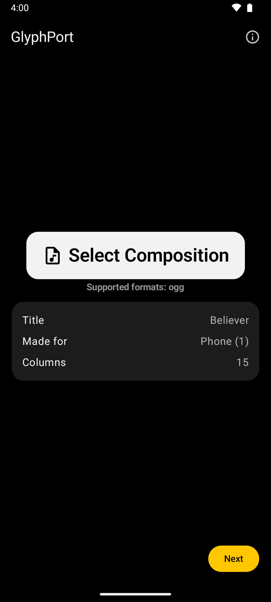
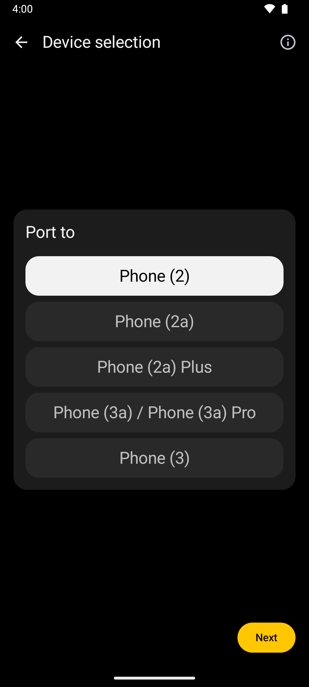
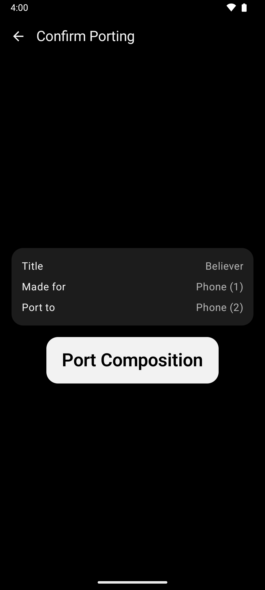
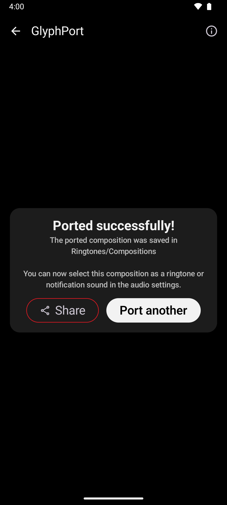

<div align="center">
  <p>
    <h1>GlyphPort</h1>
    <h6>Port Nothing® Glyph Compositions between phones</h6>
    <a href="https://github.com/SebiAi/GlyphPort/releases/latest">
      
    </a>
    <a href="https://github.com/SebiAi/GlyphPort/blob/main/LICENSE">
      
    </a>
    <br><br>
    <p>
      <a href="https://ko-fi.com/Z8Z7CAN8M">
        
      </a>
    </p>
  </p>
</div>

# :inbox_tray: Download
> [!CAUTION]
> The app does not have a self updating mechanism! Install it via **Obtainium** to receive app updates!

<p align="center">
    <a href="https://apps.obtainium.imranr.dev/redirect?r=obtainium://app/%7B%22id%22%3A%22com.sebiai.glyphport%22%2C%22url%22%3A%22https%3A%2F%2Fgithub.com%2FSebiAi%2FGlyphPort%22%2C%22author%22%3A%22SebiAi%22%2C%22name%22%3A%22GlyphPort%22%2C%22preferredApkIndex%22%3A0%2C%22additionalSettings%22%3A%22%7B%5C%22includePrereleases%5C%22%3Afalse%2C%5C%22fallbackToOlderReleases%5C%22%3Atrue%2C%5C%22filterReleaseTitlesByRegEx%5C%22%3A%5C%22%5C%22%2C%5C%22filterReleaseNotesByRegEx%5C%22%3A%5C%22%5C%22%2C%5C%22verifyLatestTag%5C%22%3Afalse%2C%5C%22sortMethodChoice%5C%22%3A%5C%22date%5C%22%2C%5C%22useLatestAssetDateAsReleaseDate%5C%22%3Afalse%2C%5C%22releaseTitleAsVersion%5C%22%3Afalse%2C%5C%22trackOnly%5C%22%3Afalse%2C%5C%22versionExtractionRegEx%5C%22%3A%5C%22%5C%22%2C%5C%22matchGroupToUse%5C%22%3A%5C%22%5C%22%2C%5C%22versionDetection%5C%22%3Atrue%2C%5C%22releaseDateAsVersion%5C%22%3Afalse%2C%5C%22useVersionCodeAsOSVersion%5C%22%3Afalse%2C%5C%22apkFilterRegEx%5C%22%3A%5C%22%5C%22%2C%5C%22invertAPKFilter%5C%22%3Afalse%2C%5C%22autoApkFilterByArch%5C%22%3Atrue%2C%5C%22appName%5C%22%3A%5C%22GlyphPort%5C%22%2C%5C%22appAuthor%5C%22%3A%5C%22SebiAi%5C%22%2C%5C%22shizukuPretendToBeGooglePlay%5C%22%3Afalse%2C%5C%22allowInsecure%5C%22%3Afalse%2C%5C%22exemptFromBackgroundUpdates%5C%22%3Afalse%2C%5C%22skipUpdateNotifications%5C%22%3Afalse%2C%5C%22about%5C%22%3A%5C%22Port%20Nothing%C2%AE%20Glyph%20Compositions%20between%20phones%5C%22%2C%5C%22refreshBeforeDownload%5C%22%3Afalse%2C%5C%22includeZips%5C%22%3Afalse%2C%5C%22zippedApkFilterRegEx%5C%22%3A%5C%22%5C%22%7D%22%2C%22overrideSource%22%3Anull%7D"></a>
    <a href="https://github.com/SebiAi/GlyphPort/releases">
    </a>
</p>

# :camera_flash: Screenshots
<p align="center">
    
    
    
    
</p>

# :pushpin: Disclaimer
> This software is provided as-is without any warranty. I and all other contributors are not responsible for any damage, misuse or other kind of physical or mental damage that results from the use of this software.
This repo is in no way, shape or form affiliated with Nothing Technology Limited (NOTHING).

# :safety_vest: Need help?
If you need help, join the Discord Server:

<div align="center">
    <a href="https://discord.gg/EmcnHqDxZt">
        
    </a>
</div>


# :construction: Compilation
This project should import straight into **Android Studio**.

For command line building:  
Make sure you have the Android SDK downloaded and that the `ANDROID_HOME` environment variable is set!
```sh
# Build
./gradlew :app:clean :app:assembleRelease
# Sign
$ANDROID_HOME/build-tools/36.0.0/apksigner sign --ks keystore.jks --ks-key-alias $KEY_ALIAS --ks-pass env:KEYSTORE_PASSWORD --key-pass env:KEY_PASSWORD --out app-release.apk app/build/outputs/apk/release/app-release-unsigned.apk
```
